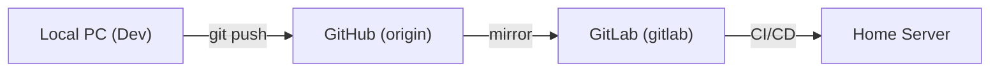

# 🛠️ Workflow: Local Development & Multi-Environment Testing

This workflow ensures the project can be tested reliably on both Local PC and the Home Server while maintaining a clean Git history.

## 1. Local Testing Checkpoints

To clear the "Networking Hurdles" (SSL/TWA/Caddy), we use a dual-approach:

### A. Direct Browser Testing (Mocked Auth)

You can now test the Medical Card without the Telegram WebApp client or a real HMAC token.

1. Set `WEBAPP_DEV_MODE=true` in your local `.env`.
2. Restart the bot: `docker-compose up -d`.
3. Open in your browser: `http://localhost:8082/card?id=304528450&token=dev`.
    * *Note: Any token works in dev mode.*

### B. Local TWA Testing (SSL Bridge)

If you need to test actual TWA behavior (JS API, bottom buttons):

1. Run a local tunnel (e.g., `ngrok http 8082`).
2. Update `WEBAPP_URL` in `.env` to the ngrok URL.
3. The bot will now generate links that work inside your mobile/desktop Telegram client.

## 2. Git Protocol: "The One-Way Mirror"

Avoid "separate commits on both" by strictly following this flow:

### ✅ Standard Protocol

1. **Never commit directly on the server**.
2. If the server is "dirty", run `git reset --hard origin/master` (the deploy script already does this).
3. **Sync Remotes**: Push to GitHub (`origin`). The built-in GitHub Action will automatically mirror changes to GitLab (`gitlab`).
   * No manual mirroring script is required.

## 3. Deployment Safety Check

Before pushing to production:

1. Verify `vX.X.X` in `cmd/bot/main.go`.
2. Check `docker-compose logs` locally for any "Panic" or "Error" loops.
3. Ensure `WEBAPP_DEV_MODE` is **disabled** (unset) in the production `.env`.
