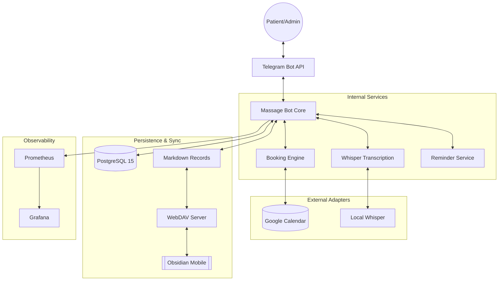

# 💆 Vera Massage Bot


## 🚀 Project Status

**Version**: v5.7.0 (Stable)
**Status**: Active Production
**Latest Features**: Integration Testing (Testcontainers), Telegram Web App (TWA), Voice Intelligence

A professional Telegram-based ecosystem for clinical massage practice. Developed for the Vera studio in Fethiye, this bot combines interactive scheduling with a robust medical recording system and seamless cross-device synchronization via **WebDAV**.

---

## 🌟 High-Value Features

### 📅 Zero-Collision Scheduling (v5.0)

The definitive scheduling engine powered by the official **Google Calendar Free/Busy API**:

- **100% Accuracy**: Respects "Out of Office", manual blocks, and external calendar overlays.
- **Just-in-Time Verification**: Eliminates race conditions by re-verifying availability at the exact moment of confirmation.
- **Interactive Confirmations**: 72h/24h reminders with patient confirmations reduce no-shows.

### 💾 Automated Backups 2.0 (v5.0)

Disaster recovery that runs itself:

- **Comprehensive Archival**: Daily ZIP backups containing the full PostgreSQL database (`pg_dump`) and patient Markdown files (`data/patients/`).
- **Telegram Delivery**: Encrypted archives delivered directly to the Admin every 24 hours.
- **Backup Verification**: `scripts/verify_backup.sh` validates ZIP integrity, required entries, and JSON parsing with explicit exit codes.
- **Self-Healing Storage**: Local temporary archives are purged after delivery to prevent disk bloat.

### 🩺 Clinical Storage 2.0

A structured **Markdown-mirrored** architecture for patient records:

- **Bi-directional Sync**: Edits made in the database reflect in `.md` files in real-time.
- **Obsidian Mobility**: Connect **Obsidian Mobile** (iOS/Android) via WebDAV to manage medical cards directly on your phone.
- **Suffix-based Lookup**: Therapist-friendly folder naming (e.g., `Ivan Ivanov (123456)`) while maintaining strict ID-based tracking.

### 🔔 Interactive Reminders

- **72h/24h Interactive Flow**: Ticker-based worker requests patient confirmation.
- **Loop-Closed Messaging**: Admins can reply to patient inquiries directly via the bot using the `✍️ Ответить` interface.
- **72h Cancellation Rule**: Enforced notice period for self-service cancellations.

### 📱 Telegram Web App (TWA)

A full-featured Mini App integrated directly into Telegram:

- **For Patients**:
  - **Medical Card**: View visit history, upcoming appointments, patient data, clinical notes.
  - **PDF Export**: Generate a professional clinical summary document.
- **For Admins**:
  - **Patient Search**: Live search across the entire database.
  - **Manual Booking**: "Create Appointment" flow to book on behalf of patients.
  - **Full History**: Access to all patient notes, files, and visit logs.
  - **Draft Approval**: Review and approve/discard transcribed voice notes before they're added to the clinical card.

### 🎙️ Voice Intelligence (Self-Hosted Whisper)

- **Transcription**: All voice messages from patients are automatically transcribed using a **self-hosted Whisper server** (faster-whisper) on the same Docker network.
- **Draft-First Pipeline**: Transcriptions saved as "pending" drafts — reviewed and approved by the therapist via TWA before being added to the medical card.
- **Context**: Transcriptions are saved to the patient's medical card (Postgres + Markdown) and forwarded to the therapist.
- **Filtering**: Intelligent filtering removes "hallucinations" (e.g., "Silence", "Thank you") from empty voice notes.

### 🛡️ Security & Hardening (v5.7.0)

- **Gitleaks Protection**: Integrated pre-commit hooks to prevent accidental leakage of API keys or bot tokens.
- **Environment Isolation**: Strict separation between `.env`, `.env.test`, and production secrets.
- **PII Shielding**: Medical records are stored in a dedicated `data/` volume with restricted filesystem access.
- **HMAC-SHA256 Signing**: All sensitive TWA routes protected by cryptographic signatures.
- **Twin-Environment Deploy**: Test and production run side-by-side for safe rollout.

### 🛠️ System Resilience

- **Health Monitoring**: Dedicated `/health`, `/ready`, `/live` endpoints and Prometheus metrics for real-time stability tracking.
- **Auto-Recovery**: Built-in 5-attempt retry loop for PostgreSQL connectivity and self-healing TWA authentication.
- **Graceful Shutdown**: Orchestrated termination of goroutines to ensure data integrity during updates.
- **Port-Collision Pre-Flight**: Deploy script checks for port conflicts before starting.

---

## 🏗 System Architecture

The project follows a **Hexagonal / Clean Architecture** pattern, prioritizing stability and dependency isolation.



- **Backend**: Go 1.25.3 (Standard Library HTTP + Telebot v3)
- **Database**: PostgreSQL 15+ (Transactional integrity) with testcontainers integration tests
- **Frontend**: Telegram Web App (Vanilla JS + CSS, zero-dependency)
- **Sync**: WebDAV Server for Obsidian mobility
- **Monitoring**: Prometheus/Grafana stack on port 8083. [View API Docs](docs/API.md) and [Metrics Reference](metrics.md)
- **Deployment**: "Twin Strategy" (Staging & Production) using Docker Compose with `scripts/deploy.sh`

---

## 📂 Project Structure

```
cmd/bot/              # Application entry point, health server, web app routing
internal/
  domain/             # Core entities (Patient, Appointment, Slot)
  services/
    appointment/      # Booking engine (slot search, conflict detection)
    reminder/         # Schedule reminder workers, lifecycle
  storage/            # Persistence layer (PostgreSQL, sessions, file mirroring)
  delivery/
    telegram/         # Bot handlers, routing, middleware, keyboards
    web/              # TWA HTTP handlers (medical card, search, draft, cancel)
  adapters/           # Third-party integrations (Google Calendar Free/Busy, local Whisper)
  ports/              # Interface definitions for architectural boundaries
  presentation/       # HTML templates, Telegram message formatting
  config/             # Environment-based configuration management
  logging/            # Structured logger wrappers
  monitoring/         # Prometheus metrics and performance collectors
deploy/               # Docker Compose, Caddyfile, Grafana dashboard, K8s manifests
scripts/              # Deployment, backup, metric compilation scripts
```

---

## 🚀 Quick Start (Production)

### 1. Requirements

- Docker & Docker Compose
- Google Cloud credentials (`credentials.json`)
- Telegram Bot Token (@BotFather)

### 2. Environment Setup

Copy `.env.example` to `.env` and fill in real values.

### 3. Deploy

```bash
# Production Deployment
./scripts/deploy.sh prod

# Test Environment Deployment
./scripts/deploy.sh test
```

---

## 🧪 Development & Testing

```bash
# Run all tests (excluding integration tests)
make test

# Run tests including integration (requires Docker)
INTEGRATION_TESTS=1 go test -tags=integration ./internal/storage

# Coverage check
make cover

# Lint
make lint

# Build
make build
```

Test coverage target: **80%+** ✅ (currently 80.0%). Integration tests via testcontainers cover PostgreSQL CRUD, session storage, and appointment metadata.

| Package | Test Strategy |
|---------|--------------|
| `internal/storage` | Unit tests + testcontainers integration |
| `internal/services/` | Unit tests (mocked storage) |
| `internal/delivery/telegram` | Unit tests (mocked bot + repository) |
| `internal/delivery/web` | `httptest` server tests |
| `internal/presentation` | Unit tests (template rendering) |

---

## ⚙️ Configuration

The bot is configured entirely via environment variables (see `.env.example` for defaults).

| Variable | Description | Required |
| :--- | :--- | :--- |
| `TG_BOT_TOKEN` | Telegram Bot API Token | Yes |
| `TG_ADMIN_ID` | Telegram ID of the primary admin | Yes |
| `ALLOWED_TELEGRAM_IDS` | Comma-separated list of allowed user IDs | Yes |
| `GOOGLE_CREDENTIALS_JSON` | Content of Google Service Account JSON | Yes* |
| `GOOGLE_CREDENTIALS_PATH` | Path to Google Service Account JSON | Yes* |
| `GOOGLE_CALENDAR_ID` | Calendar ID to manage (default: `primary`) | No |
| `WHISPER_BASE_URL` | Self-hosted Whisper endpoint (default: http://whisper:8000/v1/audio/transcriptions) | No |
| `TG_THERAPIST_ID` | Comma-separated therapist IDs (defaults to Admin) | No |
| `WEBAPP_URL` | Public URL for the Mini App | No |
| `WEBAPP_SECRET` | Secret key for Web App HMAC signature | No |
| `WEBAPP_PORT` | Port for the Web App server (default: `8080`) | No |
| `WORKDAY_START_HOUR` | Start of working day 0-23 (default: 8) | No |
| `WORKDAY_END_HOUR` | End of working day 0-23 (default: 20) | No |
| `APPT_TIMEZONE` | Timezone (default: `Europe/Istanbul`) | No |
| `APPT_SLOT_DURATION` | Slot duration (default: `1h`) | No |
| `APPT_CACHE_TTL` | Free/busy cache TTL (default: `5m`) | No |
| `DB_NAME` | PostgreSQL database name | No |
| `DB_USER` | PostgreSQL user | No |
| `DB_PASSWORD` | PostgreSQL password | Yes |
| `BOT_USERNAME` | Bot username for search page links | No |

---
*Created by Kirill Filin. Current stable release: v5.7.0.*
